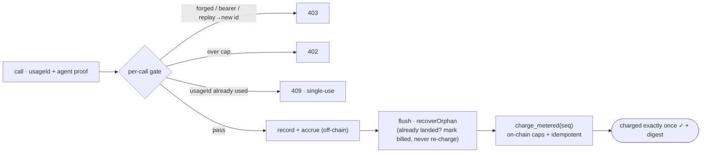
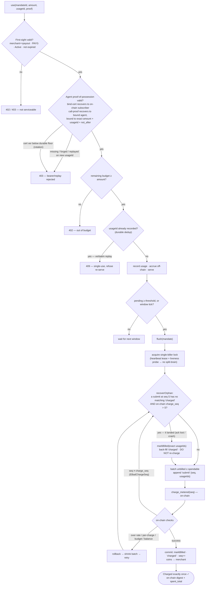

# iSub — non-custodial pull-payment rail for subscriptions & AI agents on Sui

> **In one line:** a non-custodial, capped, revocable **pull-payment primitive** on Sui — sign one on-chain *mandate* and a service (or an AI agent) charges within it, covering both recurring subscriptions (**Fixed**) and metered pay-as-you-go (**PAYG**). Funds never leave the user's wallet. **The payment rail for both human subscriptions and the agent economy.**
> **Status:** live on **Sui testnet** (package `0xb11a3def…`) — Move contracts (**72/72** tests + multiple security self-reviews) · TS SDK + managed gateway/keeper/biller · an **x402** `mandate` scheme (buyer/seller/facilitator) · **agent proof-of-possession** (replay/rollback-hardened) · a monthly **compliance CSV export** — all exercised by **real on-chain charges** and a failure-path test suite (lost-ack / crash / lock contention / replay). **AP2-aligned** (adapter planned, not yet shipped). Built for **Sui Overflow 2026**.

## What it is

Crypto payments have a real, proven gap: **non-custodial wallets can't auto-charge** — funds live in the user's own wallet, so a merchant can't pull a recurring or per-use fee without the user signing every time. Stripe can auto-renew; non-custodial crypto can't. And now **AI agents** need to pay per API call autonomously — with no human to sign each charge.

**iSub solves both with one Sui-object primitive (Account + Mandate):** the user keeps a balance in their own **Account they can withdraw from anytime**, then **signs once** to issue a **capped, revocable charge authorization (Mandate)** — **no pre-funding** (authorize moves no funds). A keeper then **pulls** within the authorized limit: a **Fixed** subscription on its interval, or a **PAYG** metered charge per use. The same mandate works whether the payer is a human checkout or an **AI agent presenting a proof-of-possession** (**x402-native, AP2-aligned**) — the agent signs an authorization, never the user's keys, and never a fresh transfer per call.

It's the **Sui equivalent of a Stripe card-on-file — but non-custodial and agent-native**, and it ships as a **primitive + SDK**: a merchant embeds it in a few frontend lines (one checkout, one plan id), with **no custody to hold and no keeper to run** in the managed path. On-chain, the contract enforces every limit (rate / per-charge / total budget / expiry / idempotent `charge_seq`), so even the keeper can only charge what the user authorized — see [Billing & anti-replay](#billing--anti-replay-money-correctness) for the money-correctness model.

## Can a service provider skip iSub?

Honest answer: **for the simplest case, yes — and they should.** If all a provider wants is *"the agent pushes a USDC payment per call from its own wallet,"* that's just **x402** — no iSub, one less layer. We don't pretend to win there.

iSub becomes load-bearing the moment you need anything a one-shot push can't give — and here Sui has a hard constraint: **Sui is push-only. There is no native pull, and no ERC-20-style `approve`/`transferFrom` allowance.** So any model where a service *pulls* within a standing, capped authorization forces the provider to **write and audit their own fund-holding Move contract** — i.e. rebuild iSub's Account + Mandate.

| What the provider wants | Cost of skipping iSub | iSub load-bearing? |
|---|---|---|
| Per-call push micropayment | Just use **x402** — *simpler* | ❌ not us |
| **Owner-enforced hard cap** on an untrusted/buggy agent ("&le; 50/mo on *this* service, can't exceed") | Push can't — the agent controls its own wallet; needs a capped-mandate object → **self-build** | ✅ |
| **Recurring / subscription / windowed metered settlement** | x402 is one-shot → **self-build** | ✅ |
| **Shared, withdraw-anytime, revocable balance** (human owns, agent operates, separable) | Push conflates owner & operator → **self-build** | ✅ |
| **Refunds · reconciliation · idempotency · crash recovery** | All of it, yourself | ✅ |
| **Non-custodial** (don't hold user funds → don't invite money-transmission) | Avoid the fund contract → only custody is left → regulatory exposure | ✅ |

**So iSub doesn't compete with x402 — it composes under it.** x402 / AP2 carry the per-call settlement; iSub is the **capped, revocable, recurring pull-authorization that Sui lacks natively** — the part a data/MCP provider would otherwise ship a fund-holding contract to get. A payments-infra company (e.g. Nevermined) might build that themselves; a data or tool company (e.g. Apify, a financial-data API) would far rather drop in a primitive than write, audit, and *secure a contract that holds money*. **The moat is precisely that "build-your-own custody contract" wall — not generic agent payment.**

## Why "subscriptions", not "streaming"

Streaming payments (Sablier / Streamflow / Coindrip) are already crowded globally and relatively simple (lock + linear release); **non-custodial delegated-pull subscriptions are a gap on Sui — harder, and they hit a real pain point**. See the validation conclusions in `product-plan/concept.md`.

## Billing & anti-replay (money-correctness)

The demo is the easy part; the hard part is being correct under failure. iSub gives three guarantees that separate a payment rail from a happy-path app:

- **Anti-replay (per call)** — every call carries a one-time `usageId` and an agent-signed proof bound to the *exact* charge. A verbatim replay is rejected (`409`); a forged/bearer call is rejected (`403`).
- **Exactly-once settlement (across crashes)** — charges accrue off-chain and settle in batches; before every on-chain charge the biller reconciles any *landed-but-unacked* charge (`recoverOrphan`), so a crash or lost ack never double-charges. `charge_seq` makes it idempotent on-chain.
- **Keeper-proof caps (on-chain)** — rate / per-charge / total-budget / balance / expiry are enforced by the contract. The keeper can only trigger charges the chain already permits, paid to the merchant — trust is liveness-only, never custody.

Full flow — per-call gate → settlement reconciliation (click to expand)

Code: per-call gate in [`sdk/src/service.ts`](sdk/src/service.ts); settlement + `recoverOrphan` in [`sdk/src/biller.ts`](sdk/src/biller.ts); on-chain caps + `charge_seq` in [`contracts/sources/subscription.move`](contracts/sources/subscription.move); agent proof-of-possession in [`sdk/src/agent-auth.ts`](sdk/src/agent-auth.ts). The per-path evidence that these hold under failure is the next section.

## Correctness under failure

The demo is the easy part. A payment rail has to stay correct when the **keeper crashes**, the **network swallows an ack**, **two billers race** the same mandate, or an **attacker replays** a captured call. Each failure path below is injected by a deterministic fault-injection suite, and every row is an assertion the suite actually prints — the guarantee is *runnable*, not prose.

**Settlement — exactly-once across crashes & races.** `npm run biller:smoke` drives the biller against a `FaithfulChain` that aborts byte-for-byte like `charge_metered` (codes `8` rate · `9` budget · `10` balance · `20` seq · `24` per-charge):

| Failure injected | Mechanism that holds | Assertion the suite prints |
|---|---|---|
| **Lost ack** — charge landed on-chain, client saw a network error (record still unbilled) | `recoverOrphan`: a `submit@seq=S` with no `charged` while on-chain `charge_seq > S` ⇒ it landed ⇒ mark billed, never re-charge | `lost-ack: charge landed exactly once on-chain (spent=50, seq=1)` |
| **Crash mid-settle**, then restart | a fresh instance over the same store replays the journal and reconciles | `restart recovery: NO double-charge (spent still 50)` |
| **Record reorder during recovery** | recovery is membership-exact **by `usageId`**, never an amount-prefix | `no double-charge: on-chain spent == sum of distinct usage (9)` |
| **Two billers race** (split-brain) | cross-instance lock + heartbeat lease + liveness probe; a superseded biller stands down | `second biller instance is locked out` · `lock released → second biller takes over` |
| **Transient RPC failure** | not-landed → retried in-flight; stuck beyond retries → classified, kept unbilled for the next window | `stuck transient → nothing charged` · `record kept unbilled for a later flush` |
| **Concurrent flush** (seq collision) | per-mandate single-flight collapses them into one charge | `single-flight collapsed concurrent flushes into one charge (seq=1)` |
| **Over-cap** (budget / rate / per-charge) | off-chain clamp to `spendable`, then the **chain re-enforces every cap** | `no single charge ever exceeds rate_cap (60)` · `charged exactly the budget (200)` |
| **Duplicate `usageId`** | idempotent ingest (mem + SQL `ON CONFLICT DO NOTHING`) | `duplicate usageId is ignored (idempotent ingest)` |

**Anti-replay / theft-of-service.** `npm run agent-auth:redteam` runs a real MCP client↔server round-trip where the attacker *shares the merchant runtime* — the agent binding is already cached, so this proves the **per-call signature** (not just the binding) is load-bearing:

| Attack | Result |
|---|---|
| **Bearer** — only the public `mandateId`, no key, no signature | **403** — theft-of-service closed |
| Replay a captured signature on a **new** `usageId` | **403** — signature bound to the exact call |
| **Verbatim** replay (same `usageId` + sig) | **409** — single-use (funds were already safe; this closes theft-of-*service*) |
| Expired sig · wrong-amount sig · expired cert | **403** — payload- and expiry-bound |
| Final on-chain reconcile | `exactly 60 charged (2 legit × 30) — no attacker call billed` |

**Why this is evidence, not a green mock.** Crashes, lost acks and split-brain can't be reproduced on a live chain on demand, so they're injected against a `FaithfulChain` that mirrors the contract's aborts exactly; the on-chain floor it stands in for (caps + `charge_seq`) carries its own Move test suite (**72/72**); and the same settlement path runs for real on **testnet** (real charge digests). The durable cert-rollback floor — a rotated-out agent key can't be replayed across a restart or a second instance — adds `npm run agent-auth:durable`.

## Engineering depth

What separates this from a happy-path demo is the surface area below. Every item is **shipped and exercised by a named test/smoke suite** (run any of them — they print per-assertion ✓); roadmap items are called out plainly at the end so the rest stays trustworthy. Each line links to its code.

**On-chain — the Move primitive.** [`contracts/sources/subscription.move`](contracts/sources/subscription.move) — **72/72** tests (23 happy-path + **49 `expected_failure` abort-path**: more than half the suite is adversarial).
- **Generic object model** — `Account<T>` / `Plan<T>` / `Mandate<T>` as shared objects; a mandate **snapshots** the plan's terms at authorize, so it keeps working even after the merchant deactivates or closes the plan.
- **29 abort-coded invariants** — rate-cap + window, `max_per_charge`, `total_budget`, balance, expiry, `not_before`, subscriber / merchant / keeper authorization, plan-active, version — each with its own negative test.
- **Terms-binding (`ETermsMismatch`)** — `authorize` signs the *exact* price / interval / merchant (Fixed) or rate-cap / window / merchant / **keeper** (PAYG); a spoofed UI, a swapped plan, or a merchant-injected keeper can't produce a mandate.
- **`charge_seq` idempotency + Fixed interval-gate** — PAYG requires an exact seq; Fixed sets `last_charged = now`, so a PTB can't double-charge in one tx.
- **Non-backflush refunds** — `spent_total` is monotonic and `refunded_total` is tracked separately, so a refunded amount can't be silently re-spent against the budget; refunds work even after revoke.
- **Pause/resume amnesty** — resume resets the window + `last_charged`, so a paused period is never back-billed.
- **Sui `Clock`-sourced time** — windows / expiry / `not_before` read the canonical on-chain clock, never a spoofable caller timestamp.
- **Upgrade-safe versioning** — a `version` gate refuses to mutate stale objects; permissionless `migrate_*` bumps them.
- **Storage reclamation** — `close_account` / `close_mandate` / `close_plan` (guarded: balance-0 / revoked-only) reclaim the storage rebate.
- **12 audit events** — `MandateAuthorized`, `Charged{seq, spent_total, by}`, `Refunded`, … drive off-chain indexing.

**Settlement & metering.** [`biller.ts`](sdk/src/biller.ts) · [`pricing.ts`](sdk/src/pricing.ts) · [`keeper.ts`](sdk/src/keeper.ts) · [`scheduler.ts`](sdk/src/scheduler.ts) — `recoverOrphan` / single-biller lock are in [Correctness under failure](#correctness-under-failure).
- **Pricing engine** — multi-meter rate cards in **exact bigint rationals** (no floats), per-meter rounding modes + `minCharge` floors, validated at startup so a bad card fails fast, not mid-billing.
- **Price-freeze at ingest** — usage is priced once and the amount frozen; a later rate-card edit can never re-price a recorded call, so settlement and reconciliation stay consistent.
- **Rate-card versioning + provenance** — each record stores `meterKey` / `qty` / `rateCardVersion` as **audit-only** fields, never a billing input.
- **Dunning lifecycle** — `past_due` → grace window → `lapsed`; a top-up recovers **permissionlessly** (auto-resume, no re-sign).
- **Failure classification** — deterministic abort (don't retry) vs transient RPC (back off) vs benign `EIntervalNotElapsed` (clock skew / a raced keeper).
- **Drift detection** — the keeper reconciles externally-triggered permissionless Fixed charges by reading on-chain `charge_seq` (`charge.observed`), with no event indexer.
- **Keeper interval math** — earliest = `max(last_charged + interval, not_before)` with a clock-skew margin; a `charge_seq` baseline makes ticks and restarts idempotent.
- **Bounded-concurrency settlement** — `mapWithConcurrency` caps RPC fan-out so a large book can't self-DoS, and one mandate's failure is isolated from the batch.
- **Carry-reason + budget events** — `budget_exhausted` / `rate_limited` / `insufficient_balance` / … plus a one-shot `budget.threshold` (default 80%), so a merchant can gate service precisely.
- **Phased plans (scheduler)** — trial → standard → pro; a **downgrade** issues a silent merchant refund of the delta (no re-sign), an **upgrade** gates on `consent.required` (never pull more without a new mandate signature).

**Agent authorization.** [`agent-auth.ts`](sdk/src/agent-auth.ts) · [`service.ts`](sdk/src/service.ts) · [`x402.ts`](sdk/src/x402.ts) · [`mcp.ts`](sdk/src/mcp.ts) — suites: `agent-auth:redteam`, `agent-auth:durable`, `per-route-auth:smoke`, `x402:smoke`, `mcp:smoke`.
- **Two-signature proof-of-possession** — a **bind cert** (subscriber signs `agent-pubkey ↔ mandate`, self-verifying against the on-chain subscriber) + a **call proof** (the agent signs every call over `mandateId · usageId · merchant · exact-payload · not_after`), ed25519 over Sui's personal-message envelope.
- **Replay / forgery closure** — single-use `usageId` (durable dedup) → verbatim replay `409`; the signature is bound to the exact call → replay-on-a-new-id `403`; a bare `mandateId` → `403`.
- **Durable cert-rollback floor** — the highest accepted cert `ver` is persisted (`agent_cert_vers`), so a leaked / rotated-out agent key can't be replayed across a restart or a second instance.
- **Per-route auth modes** — `off | warn | enforce`, set by the *trusted route* (not the client), so one service safely serves human self-metered routes (`off`) and agent / x402 routes (`enforce`); `warn` is a log-only migration path.
- **x402 `mandate` scheme** — a **pull-settled** scheme (vs `exact`'s per-call push): `402` → PoP `X-PAYMENT` → cheap chain-free `verify` → authoritative `settle`. Written up as a chain-neutral proposal (Sui reference + EVM binding sketch) in [`spec/x402-mandate-scheme.md`](spec/x402-mandate-scheme.md). *(Spec-shaped — wire-compatible with x402-v2; the scheme semantics are not yet adopted by any other implementation.)*
- **MCP server** — one server exposes wallet tools (`subscribe` / `unsubscribe` / `budget_status`) **and** metered pay-per-call tools, each gated + billed; chain-agnostic (mock chain in CI, real gRPC on testnet).

**SDK, gateway & ops.** [`gateway.ts`](sdk/src/gateway.ts) · [`signer.ts`](sdk/src/signer.ts) · [`webhook.ts`](sdk/src/webhook.ts) · [`compliance.ts`](sdk/src/compliance.ts) · [`discovery.ts`](sdk/src/discovery.ts) · [`run-stack.ts`](sdk/scripts/run-stack.ts).
- **Transport** — gRPC for writes + JSON-RPC fallback for the event scans gRPC can't serve, behind a reads-after-write barrier.
- **Signer abstraction** — `keypairSigner` (Node) and `walletSigner` (browser, **zero dapp-kit dependency**) normalize to one result shape incl. abort-code recovery, so keys / wallets are swappable.
- **On-chain discovery** — an isomorphic `suix_queryEvents` scan of a subscriber's `MandateAuthorized` events repairs the index for mandates authorized off-surface; degrades gracefully if RPC is down.
- **Relations index** — a read-only projection (merchant→plans, subscriber→mandates, owner→accounts) re-derived from chain on write, kept off the billing hot path.
- **Webhooks** — HMAC-SHA256 signed with the timestamp *inside* the signature (replay-proof), exponential-backoff retry, ordered delivery, constant-time verify.
- **Compliance export** — dual-perspective monthly CSV with on-chain digests + Suiscan links, UTC month math, exact base-unit *and* decimal columns; pure / isomorphic (browser-exportable).
- **Multi-tenant gateway** — a per-merchant isolated `IsubService` (own keeper / store / webhook), api-key routing, public reads vs api-key ingest, opt-in HTTPS, same-origin `/gw` proxy.
- **Error taxonomy** — Move abort codes `1–29` mirrored to a typed `IsubAbortError` (symbolic names), recovered from a gRPC structured error *or* a parsed string, kept in lockstep with the Move module.
- **Store abstraction** — mem / file / SQL behind one interface with **parity tests**; a durable lock with pid-liveness + heartbeat (crash takeover, no wait); an append-only journal that tolerates a truncated last line.
- **Supervisor** — `run-stack` composes gateway + keeper + biller (+ web) into one health-gated process group with graceful shutdown; *nothing in it fabricates usage*.

**Roadmap — designed, not yet shipped** (stated plainly so everything above stays trustworthy).
- **Sponsored / gasless transactions** — gas paid by the merchant / relayer; described in [`product-plan/architecture.md`](product-plan/architecture.md) but **explicitly deferred in code** ([`service.ts`](sdk/src/service.ts)). Today, charges are signed and gas-paid by the service key.
- **Privacy beyond Tier 0** — unlinkability via a burner address + zkLogin + direct on-ramp works **today as a usage pattern** (no SDK change); **stealth merchant addresses** (Tier 1) and **confidential amounts** (Tier 2) are roadmap with no code yet. Mixing pools are deliberately ruled out (they break auditability and reintroduce custody). See [`product-plan/privacy.md`](product-plan/privacy.md).
- **Scheduler PAYG repricing across phases** — the machinery exists but lacks a standalone end-to-end test.

## Docs index

- [`spec/x402-mandate-scheme.md`](spec/x402-mandate-scheme.md) — **the `mandate` x402 scheme as a chain-neutral proposal** — abstract model, two-signature proof-of-possession, wire format, Sui reference binding + an EVM binding sketch (an honest draft, not an adopted standard)
- [`product-plan/concept.md`](product-plan/concept.md) — concept, pain point, Sui-native differentiation, validation conclusions, principles fit, tracks/sponsors
- [`product-plan/architecture.md`](product-plan/architecture.md) — Move contract object model, charge/revoke, keeper, sponsored tx, SDK layering
- [`product-plan/scope-and-timeline.md`](product-plan/scope-and-timeline.md) — tiered scope (Tier 0–3), calendar plan, risks, realistic targets
- [`product-plan/privacy.md`](product-plan/privacy.md) — privacy model: unlinkable vs anonymous, burner/zkLogin/stealth addresses, deliberately no mixing
- [`sdk/README.md`](sdk/README.md) — TS SDK (gRPC) + e2e/keeper/payg/dunning scripts (localnet + testnet all green)
- [`product-plan/phase2-demo-app.md`](product-plan/phase2-demo-app.md) — merchant demo app plan (Phase 2)

## Origin

This direction was filtered out of the DeepBook topic exploration in `../PredictComposer` — after vetting ~ten DeepBook directions, all failed on "taken / too hard / won't win", and the only one verified as "a gap + feasible" was this subscription line. The full topic-selection principles and rejection record are in `../PredictComposer/topic-selection-principles.md`.
